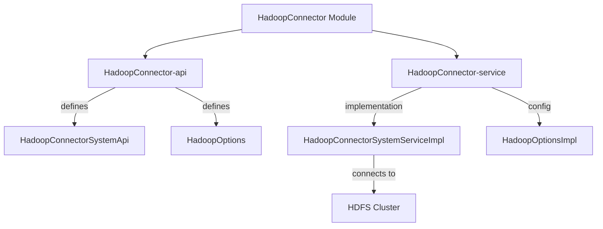

# HadoopConnector Module

## Module Goal
The HadoopConnector module provides a unified and abstracted interface for interacting with Hadoop Distributed File System (HDFS) within the Water Framework. It enables applications to upload, download, append, and manage files and folders on HDFS, abstracting the complexity of Hadoop APIs and providing a simple, permission-aware, and testable integration point.

## Architecture Overview



## Sub-modules

| Sub-module | Description |
|---|---|
| **HadoopConnector-api** | Defines `HadoopConnectorSystemApi` (file/folder operations) and `HadoopOptions` (connection config) |
| **HadoopConnector-service** | Implementation using Hadoop 3.3.5 client libraries, with `HadoopOptionsImpl` for property loading |

## Module Technical Characteristics

### Core Technologies
- **Apache Hadoop (HDFS)**: File system operations via Hadoop 3.3.5 client libraries
- **Water Framework Core**: Component system, dependency injection, and configuration
- **Lombok**: Boilerplate code reduction
- **JUnit 5**: Testing, including in-memory HDFS via MiniDFSCluster

### Architecture Components
- **API Layer (`HadoopConnector-api`)**
  - `HadoopConnectorSystemApi`: Defines file/folder operations (exists, upload, download, append, create, delete)
  - `HadoopOptions`: Service for retrieving Hadoop connection properties
- **Service Layer (`HadoopConnector-service`)**
  - `HadoopConnectorSystemServiceImpl`: Implements all HDFS operations, manages Hadoop configuration, and handles file system client lifecycle
  - `HadoopOptionsImpl`: Retrieves Hadoop URL from application properties
- **Test Layer**
  - Uses MiniDFSCluster for in-memory HDFS testing
  - Provides override for HadoopOptions to inject dynamic HDFS URLs

### Key Features
- File and folder management on HDFS (upload, download, append, create, delete)
- Pluggable Hadoop URL configuration
- Component-based, testable, and extensible design
- In-memory HDFS for robust integration testing

## Permission and Security
- The `HadoopConnectorSystemApi` is a System API, intended for internal use and bypasses the Water Framework's permission system for maximum flexibility and performance.
- All file/folder operations are performed with the permissions of the configured Hadoop user (as determined by the Hadoop cluster and connection properties).
- Input validation and error handling are implemented to prevent illegal operations (e.g., uploading to an existing path, deleting non-existent files/folders).

## How to Use It

### 1. Module Import
Add the HadoopConnector module to your project dependencies:

```gradle
dependencies {
    implementation 'it.water.connectors.hadoop:HadoopConnector-api:${waterVersion}'
    implementation 'it.water.connectors.hadoop:HadoopConnector-service:${waterVersion}'
}
```

### 2. Configuration
Set the Hadoop URL in your application properties:

```properties
water.connectors.hadoop.url=hdfs://localhost:8020
```

### 3. Basic Usage Example
```java
@Inject
private HadoopConnectorSystemApi hadoopConnectorSystemApi;

// Upload a file to HDFS
File file = new File("/local/path/to/file.txt");
hadoopConnectorSystemApi.upload(file, "/hdfs/path/file.txt", true);

// Download a file from HDFS
InputStream is = hadoopConnectorSystemApi.download("/hdfs/path/file.txt");

// Append to a file
OutputStream os = hadoopConnectorSystemApi.appendToFile("/hdfs/path/file.txt");
os.write("more data".getBytes());
os.close();

// Create a folder
hadoopConnectorSystemApi.createFolder("/hdfs/path/newfolder");

// Delete a file or folder
hadoopConnectorSystemApi.deleteFile("/hdfs/path/file.txt");
hadoopConnectorSystemApi.deleteFolder("/hdfs/path/newfolder");
```

### 4. Test Example (from `HadoopConnectorApiTest`)
- Uses MiniDFSCluster for in-memory HDFS
- Demonstrates upload, download, append, create, and delete operations

## Properties and Configurations

### Module Properties
- `water.connectors.hadoop.url`: The HDFS URL to connect to (default: `hdfs://localhost:8020`). Used by `HadoopOptionsImpl` to configure the Hadoop client.

### Test Properties (from tests)
- The test suite dynamically overrides the Hadoop URL using `HadoopOptionsImplOverride` for in-memory HDFS testing.

## How to Customize Behaviours for This Module

### 1. Custom Hadoop URL Provider
Implement your own `HadoopOptions` and register it as a component to provide dynamic or environment-specific Hadoop URLs:

```java
@FrameworkComponent
public class CustomHadoopOptions implements HadoopOptions {
    @Override
    public String getHadoopUrl() {
        // Custom logic, e.g., environment variable, service discovery, etc.
        return System.getenv("MY_HADOOP_URL");
    }
}
```

### 2. Extend or Override System Service
You can extend `HadoopConnectorSystemServiceImpl` to add custom logic (e.g., logging, auditing, additional validation):

```java
@FrameworkComponent
public class CustomHadoopConnectorSystemService extends HadoopConnectorSystemServiceImpl {
    @Override
    public void upload(File file, String path, boolean deleteSource) throws IOException {
        // Custom pre-processing
        super.upload(file, path, deleteSource);
        // Custom post-processing
    }
}
```

### 3. Add Interceptors or Listeners
Use Water Framework's interceptor or event system to add cross-cutting concerns (e.g., monitoring, security):

```java
@FrameworkComponent
public class HadoopOperationInterceptor implements Interceptor {
    @Override
    public Object intercept(InvocationContext ctx) throws Exception {
        // Pre-processing
        Object result = ctx.proceed();
        // Post-processing
        return result;
    }
}
```

### 4. Custom Test Setup
Override `HadoopOptions` in your tests to point to a test or in-memory HDFS instance, as shown in `HadoopConnectorApiTest`.

---

The HadoopConnector module provides a robust, extensible, and testable foundation for integrating Hadoop HDFS operations into Water Framework-based applications.